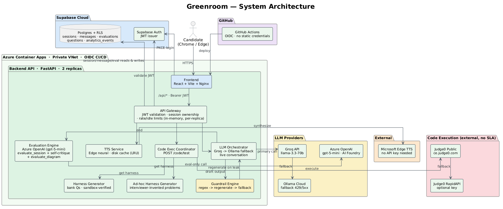
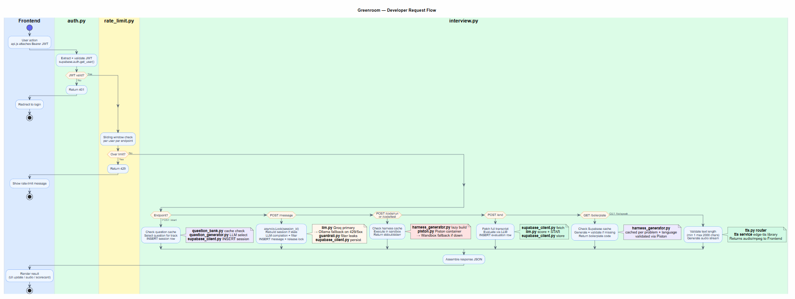

# Greenroom: Technical Design Document

**Authors:** Vishwajeet, Geet, Anurag, Nithin, Mahati, Yuang
**Version:** 7.0 · August 2026
**Status:** Active
**Live app:** https://greenroom-frontend.graybay-9c347e62.swedencentral.azurecontainerapps.io

---

## 1. Overview

### 1.1 Problem Statement

Students and early-career candidates have no free, realistic way to practice interviews with structured feedback. Existing options each miss a key dimension:

| Option | Gap |
|---|---|
| Human mock interviews | Hard to schedule, inconsistent scoring, often cost money |
| Static Q&A tools | No adaptive follow-up, no voice, no live coding |
| General AI chatbots | No interview structure, no scoring rubric, no STAR evaluation |

Greenroom fills this gap: an AI-driven interview platform that speaks out loud, runs code live, scores system-design diagrams, and delivers a structured STAR evaluation at zero cost to the candidate.

### 1.2 Goals

| Goal | Measure |
|---|---|
| Realistic AI-driven interview | Candidate completes a full session end-to-end: voice, adaptive follow-ups, scored report |
| STAR-based evaluation | Per-dimension STAR scores and improvement points on every session |
| Three interview tracks | Behavioral (STAR Q&A), Technical (live code execution), System Design (canvas + diagram scoring) |
| Curated question bank | 351 questions across all tracks, each with structured metadata |
| Free infrastructure | Zero recurring cost on Azure for Students credits |

### 1.3 Non-Goals

- Role-specific question sets beyond Software Engineer (PM, Data Science, DevOps)
- Evaluation accuracy benchmarking against human raters
- Native mobile clients (the web app itself is now mobile-responsive as of this revision — see §4 — but a native iOS/Android client is still out of scope)

Formerly listed here, now shipped: seniority-aware difficulty (an explicit junior/mid/senior selector on session start, plus AI-driven inference from the candidate's job description — see "Difficulty weighted by inferred seniority" and "AI-driven job-description analysis" in §3). A full "different question set per seniority" ask, as opposed to difficulty-weighting the existing bank, remains unscoped.

---

## 2. Architecture

Greenroom is a three-service web application. The candidate interacts through a browser. The backend handles all intelligence: LLM calls, code execution, evaluation, and session management. Supabase provides authentication and persistent storage.

### 2.1 System Architecture



> **Color guide:** Blue = client-facing core service, Green = Azure backend components, Yellow = guardrail engine / LLM providers (both conversation and evaluation), Orange = external TTS, Red = external code execution (no SLA), Purple = CI/CD
>
> **Updated 2026-08-19** to regenerate the PNG from the `.puml` source after it drifted out of sync (the source had already merged Auth Guard/Session Guard/Session Cache into a single API Gateway component and dropped the implementation-level numbered wire-protocol steps back on 2026-08-11, but the committed PNG was never re-rendered until now). Also dropped the Analytics/Telemetry component — event ingestion isn't a distinct network hop worth showing at this level, since it's written in-process alongside the session/message/evaluation persistence already covered by the API Gateway → Postgres edge — and consolidated that edge's label from a bare "session ownership reads" into "session/message/eval reads & writes" so it isn't misread as a second, redundant path to the database. Source: `docs/diagrams/architecture.puml` (PlantUML) — regenerate with `plantuml docs/diagrams/architecture.puml`.

### 2.2 User Flow


### 2.3 Developer Request Flow



### 2.4 Request Lifecycle

A complete session moves through the following steps:

1. **Authentication.** The candidate logs in via email/password. Supabase handles PKCE flow and no credentials touch the backend code. The browser receives a JWT.

2. **Session start.** The frontend sends `POST /api/interview/start` with a Bearer JWT, an optional job-description string, and an optional candidate-picked seniority (junior/mid/senior). The backend validates the token server-side against Supabase, enforces the session concurrency cap (max 3 active per user), runs `analyze_job_description()` (if JD text was supplied) concurrently with generating the opening greeting so JD analysis adds no extra latency, and returns `{session_id, question, expires_at}`. `expires_at` is `created_at + SESSION_MAX_DURATION_MINUTES` (default 60), computed server-side so the frontend's countdown timer anchors to server truth rather than a client clock that resets on refresh.

3. **Interview loop.** On each turn the candidate speaks or types a reply; the frontend sends `POST /api/interview/message`. The backend checks the session hasn't exceeded its absolute duration cap (410 once `expires_at` passes — the earlier flat 15-candidate-turn cap was removed in favor of this, since turn count was a poor proxy for how long a session actually ran), assigns a question from the bank on the first reply (lazy assignment, difficulty weighted by inferred/selected seniority and by JD-derived topics if a JD was supplied), calls the LLM, passes the response through the guardrail filter, and returns the interviewer's next question as text. The frontend speaks the reply via the TTS endpoint and shows a live mm:ss countdown (amber under 10 minutes, coral under 2) computed from `expires_at`; hitting 410 auto-triggers `/end` so the candidate lands on their report instead of seeing a "lost connection" error.

4. **Technical track.** The candidate writes code in a Monaco editor, pre-populated with real starter code for whichever language they pick, laid out LeetCode-style (problem panel with Description/Examples/Constraints tabs on the left, editor and a results console with a status pill and pass-rate bar on the right). `POST /api/interview/code/test` runs the candidate's code against the assigned problem's test cases synchronously and returns per-case results (visible cases show input/expected/actual; hidden cases show pass/fail only). A candidate can ask the interviewer, in plain language, for a different problem mid-session — this is detected server-side (no UI button), and the editor/boilerplate reset to the new question. This also works for problems the interviewer invents live in conversation, not just curated bank questions — Java/C++ test cases for ad-hoc problems previously surfaced "not yet supported" (see `adhoc_harness.py` in §3). The candidate's submitted code is persisted as part of the transcript turn itself, not just their prose message.

5. **System Design track.** Each message automatically serialises the Excalidraw canvas into a structured text description appended to the message body, so the AI interviewer can comment on the diagram in real time. The canvas also autosaves independently every 2 seconds via `POST /api/interview/diagram` (for resume-after-refresh); session-end diagram scoring reads from that autosaved state directly, rather than only the last chat-embedded description (see step 6). The board uses the same LeetCode-style left-panel layout as the technical track (functional/non-functional requirements, scaling constraints, out-of-scope tabs), a single inline strip of labeled architecture-shape insert buttons (database cylinder, cache, load balancer, message queue, CDN, API service) instead of Excalidraw's default library sidebar, and — as of this revision — the same candidate-requested "give me a different problem" flow already available on the technical track (previously silently a no-op on system-design because the router only wired it through the technical question picker).

6. **Session end.** `POST /api/interview/end` sends the full transcript to the LLM for evaluation. For system-design sessions, a second LLM call scores the candidate's diagram against the question's `expected_components` — this now reads the autosaved `diagram_elements` state directly (falling back to the chat-embedded description for compatibility), so a candidate who draws their diagram and ends the session without one more chat message still gets it graded; previously that diagram silently scored 0 as "not submitted" even though it rendered fine on the Results page. The backend persists all scores and returns a structured scorecard.

7. **Resume.** A candidate can leave mid-session and come back — `GET /api/interview/{id}/resume` restores the full message history, the assigned question, and (for system-design) the saved diagram, and counts as activity so resuming never triggers the idle timeout. The system-design canvas itself autosaves via `POST /api/interview/diagram` on a 2-second debounce.

---

## 3. Key Design Decisions

### LangChain LCEL chains

All LLM interactions use LangChain Expression Language rather than plain API calls. LCEL chains inject the full typed conversation history (`AIMessage` / `HumanMessage`) on every request via `MessagesPlaceholder`. `JsonOutputParser` validates LLM output against a Pydantic schema at parse time. Swapping the LLM provider requires changing one line — proven in practice: the end-of-session evaluation report (`evaluate_session`, `_self_critique`, `evaluate_diagram`) now runs on **Azure OpenAI (gpt-5-mini)** instead of Groq, via a second `_make_azure_llm()` factory alongside the existing `_make_llm()`. Everything else — the opening greeting, the live interview conversation, question selection, guardrail checks, harness generation — stays on Groq, unchanged. gpt-5-mini is a reasoning-family model: it only accepts the default `temperature` (passing anything else 400s) and silently burns its whole token budget on hidden reasoning unless `reasoning_effort="minimal"` is set, which is why the two factories aren't simply unified into one.

| Dimension | Plain API call | Greenroom (LCEL) |
|---|---|---|
| Conversation memory | Single turn only | Full typed history injected automatically |
| Output validation | None | Pydantic schema enforced at parse time |
| Provider swap | Rewrite every call site | One line: `ChatGroq(...)` to `ChatOpenAI(...)` |
| LLM fallback | None | Auto-retry on Ollama Cloud on 429 / 5xx |

### Lazy question assignment

Questions are assigned on the first candidate message, not when the session starts. This allows the LLM to use the candidate's self-introduction to select the most contextually appropriate question from the bank. The assignment is persisted to Supabase and injected into every subsequent LLM call.

```
POST /interview/start        ->  greeting only; assigned_question = null
POST /interview/message (1)  ->  pick_question(track, intro) -> inject into system prompt
POST /interview/message (2+) ->  question already present in session state
```

**Difficulty weighted by inferred seniority.** Question selection previously ignored the candidate's stated role entirely, using a flat random choice across easy/medium for every candidate. `infer_seniority()` buckets the free-text `role` string (e.g. "Junior Backend Engineer", "Staff Software Engineer") into `junior` / `mid` / `senior`, and every `pick_*_question()` call weights its random choice accordingly — junior interviews skew toward easy with few mediums and no hards; senior interviews skew toward medium/hard and rarely open with easy; unlabeled roles fall back to the old uniform-ish behavior. Wired through the bank picker, the behavioral/system-design pickers, and the ad hoc question-generation LLM prompt alike, so a generated (non-bank) problem's difficulty is guided the same way.

### AI-driven job-description analysis for question selection

A job description was previously only ever interpolated into the interviewer's chat prompt — never actually used to pick a question, which relied solely on `infer_seniority()`'s keyword match against the free-text role string. `question_generator.analyze_job_description()` adds a real per-session analysis step: one LLM call extracting `{"seniority", "topics"}` from the JD text, run once at session start concurrently with the opening greeting so it adds no measured latency. `pick_question()` / `pick_system_design_question()` / `pick_behavioral_question()` take `jd_seniority`/`jd_topics` params: `jd_seniority` overrides `infer_seniority(role)` when present, and `jd_topics` gets a 3x weight boost in `_weighted_choice` for topic-matching candidates (a bias, not a hard filter) — the existing role-keyword matching stays as the fallback when no JD is supplied. `select_or_generate_question`'s LLM catalog-decision prompt also includes JD-derived topics as a preference signal alongside the candidate's self-introduction. The candidate can additionally pick an explicit junior/mid/senior seniority directly on the start-session popup, which is merged into `jd_analysis` the same way an inferred one would be.

### Postgres-backed rate limiter

The rate limiter uses a `rate_limit_events` table in Supabase, with one row per request pruned after five minutes. Every backend replica queries the same Postgres instance, so the limit is truly per-user across the fleet. It falls back to an in-memory deque if the table does not exist, with a try/except guard so a missing migration never crashes the backend.

| Dimension | In-memory | Postgres-backed |
|---|---|---|
| Multi-replica correctness | Silently doubles at 2 replicas | Single shared counter across all replicas |
| Persistence across restart | Lost | Survives restarts |
| Local dev without DB | Only mode | Auto-fallback |

### Session concurrency cap, idle timeout, and absolute duration cap

Independent session-level guards in `session_guard.py`:

- **Concurrency cap:** `check_session_limit()` counts `sessions WHERE status='active' AND user_id=?`. Returns HTTP 429 if >= 3. Configurable via `MAX_ACTIVE_SESSIONS`.
- **Idle timeout:** `check_idle_timeout()` compares `last_activity_at` against `now()`. Returns HTTP 410 if > 30 minutes idle. Configurable via `SESSION_IDLE_TIMEOUT_MINUTES`.
- **Absolute duration cap:** `session_expires_at()` returns `created_at + SESSION_MAX_DURATION_MINUTES` (default 60); `check_session_duration()` returns HTTP 410 once wall-clock time passes it, independent of activity. `expires_at` is exposed on `StartSessionResponse`/`ResumeSessionResponse` so the frontend can render a live countdown anchored to server truth. Replaces the earlier flat `MAX_CANDIDATE_TURNS` (15-message) cap, which was removed entirely — turn count was a poor proxy for how long a session actually ran, since a candidate who writes long, thoughtful answers hit it much sooner than one who writes terse ones.

All guards run on every `/message` call after JWT validation, before the LLM call. A 410 from either the idle timeout or the duration cap now auto-triggers `/end` on the frontend (`useInterviewSession`) instead of surfacing a generic "lost connection" retry, so the candidate always lands on their scored report rather than a dead end.

### Judge0-based code execution (Piston + Wandbox retired, 2026-08-03)

Both prior execution backends were confirmed dead in production: Wandbox's container runtime started failing every request with a persistent OCI `crun: clone: Resource temporarily unavailable` error, and emkc.org's public Piston API (the interim replacement for the self-hosted instance) became whitelist-only and stopped accepting new callers. `services/piston.py` was rewritten around Judge0 instead — the module name is kept for now to minimize churn across call sites, but it no longer talks to Piston at all:

```
POST /api/interview/code/test
  -> Tier 1: Judge0 public instance      (ce.judge0.com, no key, no signup, no SLA)
      if unavailable -> fall through
  -> Tier 2: Judge0 via RapidAPI          (optional key, more reliable second attempt)
      if unavailable -> fall through
  -> Tier 3: Local subprocess              (Python/Node/C++ compiled+run in-container; Java has no fallback)
      if unavailable -> fall through
  -> Tier 4: "Temporarily unavailable" message to candidate
```

Judge0's own status codes distinguish a real compile/runtime result (id 6 = compile error, 11 = runtime error — shown to the candidate as-is) from a judge-side infra failure (id 13 = internal error, or a missing/unparseable status — treated as "unavailable" and retried on the next tier). The backend Dockerfile now installs `g++` so the local-subprocess fallback can actually compile C++, not just run Python/Node. The self-hosted Piston Azure Container App, its internal-only ingress, and the `piston/` directory's Dockerfile/build config are no longer part of the live deployment (see Open Risks for the leftover-config cleanup this implies).

**Ad-hoc Java/C++ test support.** Java/C++ test running previously only worked for questions pulled from the curated bank — any problem the interviewer invented live in conversation (not bank-sourced) had zero Java/C++ support and surfaced "Test cases are not yet supported." `services/adhoc_harness.py` reuses the exact generate → sandbox-verify → corrective-retry machinery already built for the curated bank (`harness_generator.py`), just keyed by problem text instead of a bank question id, with an in-memory-only cache since ad-hoc problems have no cross-candidate reuse value worth persisting to Supabase.

**Health check no longer hammers Judge0.** `/api/health` made a live, uncached call to `ce.judge0.com` on every single hit; a 50-VU k6 load test alone sent roughly 8,600 unsolicited requests to that third-party service in three minutes, and production liveness/readiness probes hitting the same endpoint continuously would do the same indefinitely. The reachability check is now cached for 30 seconds (`_JUDGE0_HEALTH_CACHE_SECONDS` in `main.py`).

**Sandbox output type crash (fixed).** `test_runner.parse_results` fed raw JSON scalars (bool/number/list) from harness output straight into `RunTestsResponse`, which requires plain strings; Pydantic v2 doesn't coerce `bool`/`int`/`list` to `str`, so any problem whose expected output wasn't already a string (e.g. "Valid Parentheses", which returns a bool) crashed `/code/test` with a 500 the frontend showed as "temporarily unavailable." Separately, `piston._judge0()` was swallowing its own transient failures (network errors, Judge0 infra glitches) and returning `None` instead of raising, so the configured `with_retry(attempts=2)` wrapper never actually retried anything — it now raises `_Judge0Transient` for retryable conditions so the retry wrapper does its job. Both verified live across all four languages.

**Java/C++ harness generation failure is no longer silent.** `generate_harness()` used to return `None` for an unsupported language, which the caller couldn't distinguish from "no problem assigned" — now raises explicitly, and `routers/interview.py`/`test_runner.py` handle that case directly.

### Dynamic test runner: two modes

The test runner handles both problem formats present in the question bank:

- **call/expected** (LeetCode-style): The LLM provides test *data* (JSON), not runnable code. The data is injected into a harness template controlled by the backend.
  ```json
  [{"call": "two_sum([2,7,11,15], 9)", "expected": "[0, 1]"}]
  ```
- **stdin/stdout** (Codeforces-style): The candidate's raw source is the program. Each test case provides `stdin`; stdout is compared against expected output. All languages Judge0 supports are valid with no whitelist.

### Per-language boilerplate: dataset-first, LLM as fallback

Java and C++ require a full compilable harness: imports, main, type-safe assertions. Generating this correctly with an LLM alone had a measured ~40-60% first-try success rate — enough failure that a large share of questions were permanently unusable in those two languages. The current approach sources real, official LeetCode starter code directly from a public problem dataset (`neenza/leetcode-problems`, matched to the bank by title) wherever a match exists, and builds the java/cpp test-driver deterministically (no LLM call) from the bank's own typed test data — parsing the dataset's own method signature, translating each test's arguments into typed literals, and generating the compare/print logic from a fixed template. Every generated boilerplate+driver is compiled in the sandbox before it's ever cached; nothing is served unverified.

Where no dataset match exists, or the deterministic driver can't handle the problem's shape (a custom type, a stateful/constructor-based problem), the backend falls back to the original approach: the LLM generates three sections (boilerplate, reference solution, test harness), the reference solution is run through the sandbox to verify all test cases pass, and the result is cached under `questions.harnesses[language]`. This path also feeds the exact compiler/runtime error from a failed attempt back into the next retry (`_GENERATION_ATTEMPTS = 4`) instead of blindly re-generating from scratch, and permanently caches a negative result (`_UNSUPPORTED_MARKER`) once every attempt is exhausted, so the same known-hard question is never silently re-attempted on every future request. A question whose java/cpp harness remains unsupported after all of this is either served in Python/JS only, or — for a subset that repeatedly failed — swapped for a same-difficulty, same-topic replacement problem from the same dataset, itself only accepted once its solution is sandbox-verified against the problem's own official example output.

Python and JS don't need a harness — the test runner calls the candidate's function directly — but they still get a question-specific signature instead of a blank editor, sourced the same dataset-first way. For LeetCode-style `Solution().method` problems the parameter names are otherwise extracted deterministically from the bank's own test data (so a candidate can never see a keyword-argument name that doesn't match what the test runner will actually call); for plain functions and stateful/constructor-based problems the signature is LLM-generated and syntax-verified as a last resort. Either way, the candidate's editor starts on the same boilerplate every time, and a reset button in `CodeEditor.jsx` restores it if they want to start over.

### Question-bank call-signature integrity (bug found and fixed 2026-08-04)

The Python and Node/JS test harnesses (`test_runner.py`) execute each test case's stored `call` string verbatim via `eval`/`exec` — e.g. `Solution().isPowerOfFour(n = 16)` for a class-based (LeetCode-style) problem. An audit of the live `questions` table found **137 of 210 class-based technical questions** had `tests[].call` strings missing the `Solution().` prefix implied by their own `function_name` (e.g. bare `isPowerOfFour(n = 16)` instead of `Solution().isPowerOfFour(n = 16)`) — every submission, including perfectly correct code, threw `NameError`/`ReferenceError` and failed all tests. This was corroborated by production telemetry: the technical track's average score (2.4/10) was far below behavioral (5.0) and system-design (4.0), with 8 of 14 completed sessions scoring 0-2. All 137 rows were patched in place (`tests[].call` now consistently prefixed); verified zero remaining mismatches.

Fixing that surfaced a second, independent, pre-existing bug: JavaScript throws `Class constructor X cannot be invoked without 'new'` on a bare `Solution()` call, which is valid Python but not valid JS. `_node_harness` now runs a targeted transform (`_add_js_new_keywords`) that inserts `new` before any capitalized identifier in a fresh-instantiation position (start of the call, or right after `=`/`;`) without touching method calls — verified live against Judge0 for both languages on the previously-broken question. Java/C++ were unaffected by either bug: their harnesses are LLM-generated from `function_name` and sandbox-verified before ever being cached, never executing the raw `tests[].call` string.

### Question-bank audit and repair pipeline

Two complementary read-only auditors run against the live `questions` table: `backend/scripts/audit_question_bank.py` checks structural completeness (required fields present, harnesses/signatures for languages claimed as supported), and `backend/scripts/_deep_audit.py` checks content-level correctness (`call`/`expected` parseability, duplicate test cases, harness/`function_name` consistency). Paired with `services/question_schema.py` (a Pydantic contract for a bank entry, applied as a soft validation warning on the `question_bank.py` load path) and `services/harness_verify.py` (an LLM-free compile+run check), plus `repair_question_bank.py`/`_fast_repair.py` for sandbox-verified fixes. This pipeline found and fixed 74 questions with duplicate test cases in the original seed data (backfilled with new sandbox-verified cases), and led to deleting 6 questions (`constructing-two-increasing-arrays` and 5 others) whose Java/C++/Node support resisted correct derivation after multiple brute-force-cross-validated attempts, rather than shipping unverified solutions. The bank is 351 questions (289 technical + 42 behavioral + 20 system-design), down from 357, and passes both audits fully.

### Four-layer guardrail against answer leaks

The AI interviewer must never reveal the answer or optimal complexity. Four independent layers enforce this:

1. **Prompt hardening:** Track personas explicitly forbid stating time/space complexity or recommending specific algorithms.
2. **Regex detection:** Patterns catch common leak signals the model still produces (e.g. "O(n)", "time complexity is", "you should use a hashmap").
3. **Regeneration:** On detection, the response is regenerated with a corrective instruction: "your previous draft leaked the answer, rewrite it so it only asks a question."
4. **Safe fallback:** If the regenerated response still leaks, a pre-written safe question replaces it entirely.

### JWT + RLS: three ownership verification layers

Every request passes through three independent ownership verifications:

1. `auth.py` validates the JWT via `supabase.auth.get_user(token)`, always server-side, never decoded locally.
2. `check_ownership()` in `session_guard.py` compares `session.user_id` against the authenticated user's ID.
3. Postgres RLS policies enforce the same ownership rule independently at the database level.

Even if application code contained a bug, the database would not return another user's rows.

### Two-key architecture

The frontend holds only the Supabase **anon key** (safe to expose, used for PKCE login). The backend holds the **service-role key** (secret, injected via environment variable at deploy time, never sent to the browser). The service-role key bypasses RLS so the backend can write on behalf of any user, but it is never exposed outside the server process.

### Diagram evaluation: system-design track

When a system-design session ends, `llm.evaluate_diagram()` scores the candidate's Excalidraw canvas against the `expected_components` list on the assigned question. The LLM returns structured JSON: components found, components missing, proximity score (0-10), label, and one-sentence feedback. The Results page renders this as a dedicated Architecture Diagram card with a colour-coded component checklist.

**Fixed 2026-08-04:** `evaluate_diagram()` previously only extracted a diagram description from `[Architecture diagram]` blocks embedded in past chat messages (via the frontend's `generateBoardDescription()`, called only from the send-message handler) — it never looked at the autosaved `session["diagram_elements"]` state from `POST /api/interview/diagram`. A candidate who drew their diagram, reviewed it, and clicked "End session" without one more chat message — a completely natural flow — got `proximity_score: 0` and "no architecture diagram was submitted," even though their diagram was saved and rendered correctly on the Results page. `_describe_diagram_elements()` (a Python port of the frontend's `generateBoardDescription()`) now builds the same structured description directly from `diagram_elements` and is preferred over the chat-history extraction, which remains as a fallback.

**Unvalidated LLM output could crash session end (fixed).** The raw LLM JSON from `evaluate_diagram` flowed unvalidated into `EndSessionResponse(diagram_evaluation=...)`, which enforces a strict 3-value `Literal` for `proximity_label` and an `int` for `proximity_score`. Any LLM wording drift (e.g. "Strong design!" instead of exactly "strong") would 500 the entire `/api/interview/end` call, losing the candidate's overall score too — the same failure class as an earlier `evaluate_session` crash, just not covered on this path. `evaluate_diagram` now validates its own output and derives `proximity_label` from `proximity_score` rather than trusting the LLM's free-text label, so it can never disagree with the score or fail the literal match. Covered by 3 unit tests (not reproducible live locally — Azure OpenAI isn't configured in dev).

### TTS response caching

`GET /api/tts/speak` previously regenerated audio via `edge-tts` from scratch on every call, even for text already synthesized moments earlier — a candidate replaying the interviewer's question, or navigating back to one already asked, paid the full latency and (conceptually) cost again. `services/tts.py` now caches on disk, keyed by `sha256(voice:text)`, with atomic writes (temp file + rename) and LRU eviction once the cache exceeds a bounded entry count.

### Self-critique pass on the evaluation chain

`evaluate_session()` runs a second LLM pass after the draft score and feedback are generated: a reviewer persona checks the draft against the transcript and corrects it where the score doesn't match the written feedback, the feedback reads as generic filler, or the transcript has evidence the first pass missed. If the draft already holds up, the reviewer is instructed to leave it unchanged rather than edit for its own sake. The pass is best-effort — any failure (bad JSON, LLM error) just falls back to the original draft, so it can never turn a working evaluation into a broken one, and it's controlled by `EVAL_SELF_CRITIQUE_ENABLED` so it can be switched off without a code change if it adds latency or cost that isn't worth it.

**gpt-5-mini could silently produce no output on a long transcript (fixed).** gpt-5-mini can burn its entire completion-token budget on hidden reasoning for a real (long/technical) transcript even with `reasoning_effort="minimal"`; the 700-token budget originally tuned for Groq's plain chat model had no headroom for this, raising `openai.LengthFinishReasonError` and surfacing as "Failed to end session." `evaluate_session`, `_self_critique`, and `evaluate_diagram`'s Azure token budgets were raised to 4000/4000/2000. Separately, `evaluate_session`'s Ollama-cloud fallback call sat outside its own try/except, so when the fallback also failed (e.g. `FALLBACK_BASE_URL` doesn't resolve) the exception escaped uncaught and 500'd the whole request instead of degrading to the existing "could not generate a report" response — wrapped in its own try/except, matching the pattern `evaluate_diagram` already used correctly.

### Load-test-driven concurrency fixes

A 50-concurrent-user k6 load test against production (`infra/loadtest/`) surfaced three distinct, compounding capacity problems, fixed in the order they were found:

1. **Blocking DB calls froze the event loop.** `check_rate_limit()` and `check_session_limit()` make blocking Postgres round-trips via the Supabase client but were called as plain synchronous calls inside async route handlers — unlike the LLM calls in the same functions, which already correctly used `run_in_threadpool`. Every request briefly froze its replica's single-threaded event loop, so concurrent requests queued behind each other's blocking DB calls instead of running concurrently. Initial run: 77.9% request failure rate, p95 latency 11.3s, with Azure already scaled to 4 replicas — not a raw-capacity problem. Wrapped all 8 call sites (`routers/interview.py`, `analytics.py`, `tts.py`) in `run_in_threadpool`.
2. **Unpooled Groq/HTTP connections.** Fixing (1) alone surfaced `[Errno -5] No address associated with hostname` failures on `/start` and `/message`: `_make_llm()` constructed a brand-new `ChatGroq` (and its underlying HTTP client) on every single call, `_fallback_chat()` used a one-off `httpx.post(...)`, and `guardrail.py`'s two LLM-judge calls did the same — 50 concurrent requests meant dozens of simultaneous fresh DNS lookups + TLS handshakes overwhelming the container's resolver. `_make_llm`/`_make_azure_llm` are now `@lru_cache(maxsize=8)`, keyed on the small bounded set of `(temperature, max_tokens)` combos actually used; `_fallback_chat` and guardrail's two judge calls share one module-level `httpx.Client()` each.
3. **Groq's real rate limit.** Even with pooling, Groq's actual account limit (confirmed live via a 429 body: "Limit 30, Used 30") is 30 requests/minute, shared across every call this backend makes — interviewer conversation and guardrail's LLM judges, across all replicas. Every request still tried Groq first regardless, wasting latency on a doomed call before falling back. `services/rate_limit.py`'s `groq_budget_available()` reuses the existing cross-replica Postgres-backed limiter with one shared key (24 RPM, safely under Groq's real 30); `opening_message()`/`next_question()` and guardrail's two judges check the budget first and go straight to the (now pooled) Ollama fallback when it's exhausted. A follow-up bug: the budget key's sentinel string wasn't a valid Postgres `uuid`, so every check silently degraded to the per-replica in-memory fallback, defeating the point at ~4 replicas — fixed by using the reserved nil UUID (`00000000-0000-0000-0000-000000000000`) instead.

This doesn't raise Groq's actual ceiling (an account/billing question, not a code one) — it makes the app degrade gracefully via the fallback path once that ceiling is hit. The load-testing setup itself (`stress/stress.js`, `stress/fetch_stress_tokens.py`) was also rebuilt: the previous copy pointed at a decommissioned hostname with tokens expired since 2026-07-10 and shared 10 accounts across 50 virtual users (tripping per-user rate-limit/session-limit artifacts unrelated to real capacity); it now targets the live host with 50 dedicated throwaway accounts and fetches fresh tokens via a paced, backed-off script. `infra/loadtest/` (k6, separate from `stress/`) additionally ran a clean 17,226-request/3-minute baseline at up to 50 VUs with 0% errors and p95 274ms post-fix.

### Request latency bounding and generation dedup

Neither the primary Groq client nor the Azure evaluator client had an explicit timeout (only the Ollama fallback did) — a slow/hanging upstream call had no bound and could leave "End session" looking stuck for minutes. Both now set `request_timeout` (45s Groq, 60s Azure — the reasoning-model evaluator gets more headroom) via `LLM_REQUEST_TIMEOUT_SECONDS`/`EVAL_REQUEST_TIMEOUT_SECONDS`. Separately, the existing test-case/harness caches only saved cost on a cache *hit* — two concurrent misses for the same key (e.g. two "Run Tests" clicks, or two open tabs) each still triggered their own LLM call. `services/singleflight.py` (`KeyedLocks`/`AsyncKeyedLocks`) adds double-checked locking to `test_runner.get_or_generate_cases`, `adhoc_harness.get_or_generate(_signature)`, and `harness_generator.get_or_generate`, so a second concurrent call for the same key waits on the first instead of duplicating the work.

### Model benchmarking harness

`backend/scripts/benchmark_models.py` runs representative-sized prompt scenarios (opening/followup/eval, sized like the real `services/llm.py` call sites) against every actually-configured provider, capturing real latency and token usage and computing cost only where a rate is configured in `data/model_rates.json` ($/1M-token, all null by default — never fabricated, filled in per environment). Running it against this environment surfaced that the actually-configured `FALLBACK_MODEL` is `gpt-oss:20b` (not the `llama3.3:70b` shown as the code default) and runs 3-5x slower than Groq across every scenario — a reasoning model burning tokens on hidden reasoning, consistent with existing latency notes in `test_runner.py`.

### Mobile responsiveness

The app previously had no real mobile layout. `Navbar.jsx` had zero mobile handling on the auth-state buttons — replaced with a hamburger menu below `md` (44px tap target, full-width primary CTA), verified via Playwright at a 375px viewport with zero horizontal overflow on Landing/Login/Signup. `Interview.jsx`'s technical/system-design grid layout (`grid-rows-[minmax(0,1fr)]`, `h-full`) was written only for the `lg:` two-column case but still applied below `lg` where columns stack, collapsing the second stacked section (code editor / diagram board) to a sliver with no real height — scoped the fixed-height machinery to `lg:` and above. `CodeEditor.jsx` and the system-design split both had a fixed-width side panel (`w-[38%] min-w-[320px]`) with no responsive handling, guaranteeing horizontal overflow on any phone — both now stack vertically below `md`/`lg`. `Dashboard.jsx`'s session table gained an `overflow-x-auto` guard. `Landing.jsx` and `Telemetry.jsx` were already responsive and left untouched.

---

## 4. Scope

### Implemented

- **Behavioral track:** multi-turn STAR-format Q&A with TTS voice; question assigned from the bank on first reply via `pick_behavioral_question()`, difficulty weighted by inferred/selected candidate seniority and JD-derived topics
- **Technical track:** LeetCode-style split layout (problem panel with Description/Examples/Constraints tabs left, Monaco editor + results console right), synchronous code execution (Python, JS, Java, C++) via Judge0 (public → RapidAPI → local subprocess), dynamic test runner (call/expected + stdin/stdout), question-specific starter code for every language (real official starter code sourced from a public LeetCode dataset wherever matched, LLM-generated and sandbox-verified as fallback) with a reset-to-original button, candidate-requested question switching mid-session (detected server-side from plain conversational language, no button), all languages supported for stdio problems, ad-hoc (interviewer-invented) problems also get Java/C++ test support, difficulty weighted by inferred/selected seniority and JD topics, submitted code persisted in the saved transcript (not just prose)
- **System Design track:** Excalidraw canvas with real-time serialisation, matching LeetCode-style layout (functional/non-functional requirements, scaling constraints, out-of-scope tabs, `scale_metadata` header chips where present) and an inline architecture-shape strip instead of Excalidraw's default library sidebar; diagram scoring at session end against `expected_components`, scored from the autosaved board state directly rather than only a chat-embedded description, and validated server-side so LLM wording drift can't crash session end; candidate-requested question switching mid-session now also works on this track (previously technical-only)
- **Session management:** concurrency cap (max 3, HTTP 429), idle timeout (30 min, HTTP 410), absolute session duration cap (60 min by default, HTTP 410, with a server-anchored countdown in the UI — replaces the earlier 15-message turn limit), session history and delete, full session resume (message history, assigned question, and system-design diagram restored), paginated session listing via `GET /api/interview/sessions` (Dashboard reads through the API instead of querying Supabase directly from the frontend)
- **Question bank:** 351 questions total, all served from Supabase across all three tracks, audited by two complementary read-only tools (`audit_question_bank.py`, `_deep_audit.py`) and passing both:
  - 289 technical: LeetCodeDataset (Kaggle / newfacade, MIT) + CodeContests (DeepMind, CC-BY-4.0) + `neenza/leetcode-problems` (boilerplate source) + hand-written; all constraints and examples filled; 6 questions removed whose Java/C++/Node support resisted correct derivation
  - 42 behavioral: `ashishps1/awesome-behavioral-interviews`; each with `expected_elements` (STAR components)
  - 20 system-design: `donnemartin/system-design-primer`; each with `expected_components` for diagram scoring and structured `scale_metadata` tags (daily active users, throughput, latency targets) extracted from each question's own prompt/constraints text
- **Personalization:** optional job-description text (LLM-analyzed into seniority + topics, run concurrently with the opening greeting) and an optional explicit junior/mid/senior selector on session start, both feeding question selection
- **LLM pipeline:** Groq (Llama 3.3 70B, or the currently-configured chat model — see env vars) primary with Ollama Cloud fallback for the live interview (greeting, conversation, question selection), gated by a shared cross-replica Groq request budget so doomed calls fail over immediately instead of round-tripping first; Azure OpenAI (gpt-5-mini) for the end-of-session evaluation report and self-critique pass; pooled/reused HTTP clients throughout; explicit request timeouts (45s Groq, 60s Azure); in-flight generation deduplication for concurrent cache misses; LangChain LCEL chains throughout; four-layer guardrail
- **Code execution:** Judge0 public instance (primary) → Judge0 via RapidAPI (secondary) → local in-container subprocess (Python/Node/C++ last resort) — self-hosted Piston and Wandbox both retired after being confirmed dead in production, and the unused Piston Container App/directory since fully removed from Azure and the repo; ad-hoc Java/C++ test support for interviewer-invented problems; `/api/health`'s Judge0 reachability check is cached (30s) instead of hitting the public API on every probe
- **Auth:** Supabase email/password + PKCE OAuth; JWT validated server-side on every request; Postgres RLS
- **Rate limiter:** Postgres sliding-window (30 req/min standard, 20 req/min code); in-memory fallback; all blocking rate-limit/session-limit DB calls run off the event loop (`run_in_threadpool`); TTS gated behind the same auth + rate limit as every other endpoint; analytics event/stats endpoints rate-limited and payload-size-bound
- **Response caching:** TTS audio cached on disk by `sha256(voice:text)` with LRU eviction — no more full re-synthesis for repeated/replayed questions
- **Navigation labels:** the interview-list page is labeled "Your Interviews" (was "Dashboard"), and the stats page is labeled "Dashboard" (was "Telemetry") — routes (`/dashboard`, `/telemetry`) are unchanged, only nav text and page headings moved
- **Analytics dashboard:** difficulty/topic breakdown per track, average session duration, and page-view tracking (`page_view_total{path}`) in addition to the original completion/score metrics
- **Mobile responsiveness:** hamburger nav, stacked (not clipped) technical/system-design layouts below `lg`, and a scrollable session table on small viewports
- **Observability:** structured JSON logging via `structlog`, now covering services that previously swallowed failures silently and persisting unhandled request exceptions as `analytics_events` rows; Prometheus `/metrics` on the backend (LLM latency/error/cost, guardrail triggers, code-execution outcomes, session funnel, evaluation scores, page views); a Grafana dashboard (26 panels across 6 labeled sections) fed by both local Loki/Promtail and, for production, Azure Monitor Log Analytics via KQL; GitHub Actions CI/CD gated on lint/type-check/pytest/Vitest, with post-deploy health verification and automatic rollback (see §7)

### Known infrastructure constraints

- **Code execution depends on a third-party public service (Judge0):** since the self-hosted Piston sandbox was retired (see §3), execution reliability is bounded by `ce.judge0.com`'s uptime/SLA (none guaranteed) and, secondarily, RapidAPI's Judge0 quota if a key is configured. The Azure-privileged-mode limitation that motivated self-hosting Piston in the first place (`--privileged` Docker blocked on the free consumption plan) is now moot, since nothing self-hosted needs it — but it trades a controlled-uptime internal dependency for an external one. See Open Risks.
- **Groq's real account limit is 30 requests/minute**, shared across every call this backend makes to it, across all replicas — mitigated by a shared budget pre-check and Ollama Cloud fallback (§3), but still a hard external ceiling under enough simultaneous new sessions.
- **Supabase free tier:** 500 MB storage, 2 connections/second ceiling.
- **Web Speech API:** browser speech recognition only works in Chrome and Edge, and requires HTTPS in production.

---

## 5. Security

**Controls in place:**

- Every request validated server-side via `supabase.auth.get_user(token)`; JWT never decoded locally — including the TTS endpoint, which now requires the same bearer token and rate limit as every other route
- Session ownership checked in application code (`check_ownership`) and independently enforced by Postgres RLS policies
- All inputs validated by Pydantic before any business logic runs: 100 KB max source code, 20 KB max message, 2,000 chars max TTS text, 50 chars max language/version strings
- No SQL injection surface; all database queries use the Supabase SDK's parameterized methods
- Secrets only in environment variables, confirmed by code grep and CI fitness function; nothing hardcoded
- CORS locked to the deployed frontend origin via `ALLOWED_ORIGINS`
- Four-layer guardrail prevents the LLM from leaking problem answers or optimal solutions
- `analytics_events.session_id` and `rate_limit_events.user_id` now have real foreign keys back to their parent rows (previously orphaned on session delete, unlike every other user/session-owned table)
- `dompurify` pinned via a package override to a patched version, closing a known XSS advisory in the transitive dependency chain
- Container vulnerability scanning (Trivy) on the built backend image on every deploy, plus `pip-audit`/`npm audit` in CI and Dependabot for pip/npm/github-actions — all currently informational (non-blocking), results surfaced in the repo's Security tab; see §7 for why they aren't a hard gate yet
- Architecture fitness function in CI checks: frontend never imports `SERVICE_ROLE_KEY`; every session endpoint calls `check_ownership`
- Deploy now gates on the CI workflow (lint/type-check/pytest/Vitest) succeeding via `workflow_run`, instead of racing it independently — a failing test suite can no longer ship to production in parallel with CI reporting it broken

**Known gap: CI/CD authenticates to Azure with a stored secret, not OIDC.** DESIGN.md previously stated the pipeline used OIDC federated identity with no stored Azure credentials — that was aspirational, not actual: the live `deploy-containers.yml` authenticates via `azure/login@v2` with a single stored `AZURE_CREDENTIALS` secret. Whether an OIDC federated credential is actually configured in Azure AD for this app is unconfirmed, so the migration hasn't been made against a live deploy pipeline on an unverified assumption. The exact migration path (which secrets to add, the workflow diff, and the order of operations — confirm the credential exists, add new secrets, swap the login step, test via `workflow_dispatch`, only then delete the old secret and revoke its password) is documented in `DEPLOYMENT.md`.

**Known gap: reliance on an external, no-SLA sandbox provider**

Code execution now runs entirely on Judge0 (public instance, optionally RapidAPI), neither self-hosted nor internal-only, replacing the earlier Piston isolation-gap concern with a different tradeoff: submitted candidate code executes on infrastructure Greenroom doesn't control or isolate itself. The local-subprocess last-resort fallback is weaker still — it runs directly in the backend's own container, not a separate sandbox, for Python/Node/C++ (Java has no fallback tier at all). Mitigated today by trusting Judge0's own isolation and treating the local-subprocess tier as a rare, best-effort last resort rather than a steady-state path. A production fix would self-host Judge0 (or gVisor/nsjail-backed Piston) behind Azure's internal-only ingress once budget allows a dedicated workload profile.

---

## 6. Testing and Observability

### Testing

| Layer | Coverage |
|---|---|
| `pytest` unit tests | 216 tests total. Guardrail logic, Pydantic model validation, rate limiter behaviour (incl. the Groq budget check), session ownership/concurrency-cap/idle-timeout/duration-cap, the full Supabase write path (`persistence.py`), Judge0 execution chain and status-code classification (`piston.py`), ad-hoc Java/C++ harness generation (`adhoc_harness.py`), dynamic test-runner call/expected + stdin/stdout modes, diagram-evaluation output validation, JD analysis (success/failure/fallback matrix, weighted-choice topic boost under statistical bounds), health-check caching, singleflight dedup, benchmark cost-math |
| Router-level tests | `interview.py` (session start/message/resume/diagram/code-test/delete/end) — mounts just the interview router (not the full app, which loads real Supabase creds from `.env` at import time) |
| Architecture fitness functions | Frontend never imports `SERVICE_ROLE_KEY`; `supabaseClient` does not reference service-role credentials |
| `Vitest` frontend tests | 32 tests across 4 files: API module surface contracts, security boundary check, `useCodeRunner` (starter code defaults, boilerplate fetch on language switch), `useInterviewSession` (session lifecycle, diagram warning, duration-countdown auto-end, 429/410 handling, post-lock send-blocking) |
| CI gate | Lint (ruff), type-check, pytest, Vitest; Docker build blocked until all pass; container/dependency vulnerability scanning (non-blocking, see §5) |

Planned additions: `httpx.AsyncClient` integration tests covering endpoint ownership checks, rate limiter boundaries, and Pydantic validation edge cases; expanded Vitest coverage for remaining hooks and page components; a real (non-`workflow_dispatch`) run of `infra/loadtest/interview_flow.js`, which exercises the expensive LLM/Judge0 path but needs a live Supabase auth token to run.

### Observability

Structured JSON logging via `structlog`, wired into every service that previously swallowed failures silently (`question_generator`, `question_bank`, `harness_generator`, `guardrail`, `tts`, `test_runner`, `rate_limit`) instead of a bare `except: pass`. Unhandled request exceptions are persisted as a `backend_error` `analytics_events` row (not just stdout), tagged to the requesting user when a bearer token is present. Every request log line carries a best-effort `user_id` (JWT `sub`, tagging only — never used for authorization) for per-candidate log filtering.

`GET /metrics` (prometheus-client) exposes request rate/latency/error-count labeled by route template (not raw path, to avoid cardinality blowup), plus `services/metrics.py` counters/histograms for LLM provider latency and error rate, fallback triggers, token usage and cost (via `data/model_rates.json`), guardrail leak detections, code-execution outcomes/latency, session funnel, evaluation score distribution, and page views (`page_view_total{path}`) — instrumented into `llm.py`, `guardrail.py`, `piston.py`, and `routers/interview.py`.

**Local and production Grafana.** `docker-compose.yml` wires the backend to Prometheus, Grafana, and Loki/Promtail for local dev (auto-provisioned dashboard). The same dashboard now also reads production traffic: Prometheus scrapes the live backend's `/metrics` over HTTPS in addition to the local copy (`$env` variable switches between them, defaulting to production), and a separate panel reads structured application logs directly from Azure Monitor Log Analytics via KQL (`infra/grafana/provisioning/datasources/azure-monitor.yml.example`) — local Loki/Promtail only ever sees Docker-local traffic, since Azure Container Apps gives no Docker socket to read from, so this was the only way to see real production log lines. A Postgres-backed `$user_id` dropdown (`supabase-postgres.yml.example`) lists recent candidates by email/last-session time for per-candidate filtering, replacing a free-text UUID box; getting its KQL query correct against `$user_id` took several follow-up fixes (duplicate panel id, missing Log Analytics workspace resource reference, an unbounded query hitting Log Analytics' 30,000-row cap, and finally `tostring(parsed.user_id) in ($user_id)` instead of manual quoting, the working idiom for both the "All" and single-selection cases). The dashboard's 26 panels are grouped into 6 labeled sections (HTTP traffic, Sessions & product usage, AI/LLM pipeline, Guardrails & code execution, Evaluation quality, Logs) with consistent units, descriptions, and `or vector(0)` on every rate/quantile query so an empty panel renders a flat 0 line instead of Grafana's "No data" overlay.

An in-app telemetry dashboard (`GET /api/analytics/stats`, `frontend/src/pages/Telemetry.jsx`) surfaces total/completed sessions, average score overall and per track with a completion-% ring, a 14-day session-activity chart, code-run language usage, score distribution, average session duration, and a difficulty/topic breakdown per track (top 8 topics, merging genuine singular/plural duplicates like "array"/"arrays") — built directly from the `sessions`/`analytics_events` tables plus the in-process question bank, no extra DB round trip.

**Load testing.** `infra/loadtest/` (k6: `health_baseline.js`, `interview_flow.js`) and `stress/` (a separate, previously-broken 50-VU harness, rebuilt with live throwaway accounts and paced token fetching) are both now real and runnable against the live deployment — see §3 for what running them actually found and fixed.

Planned additions:

- Sentry free tier for error tracking
- Azure Log Analytics / Application Insights alert rules (5xx rate, restarts, high CPU) across all Container Apps — drafted in `infra/monitoring.bicep` + `infra/deploy-monitoring.sh` (no longer references the decommissioned Piston app), but not yet deployed; needs `environmentId`/alert-email filled in and a `what-if` review before applying
- A logged event specifically for guardrail triggers and LLM fallback occurrences — the Prometheus counters in `services/metrics.py` now cover this going forward, but there's no equivalent for historical/pre-instrumentation data

**Privacy:** Candidates can delete all session data at any time via `DELETE /api/interview/{id}`. Source code is sent to Judge0 (an external public service) for execution, and to the backend's own container as a last-resort local fallback; this is disclosed. No PII is logged.

---

## 7. Deployment

### Service URLs

```
Frontend   https://greenroom-frontend.graybay-9c347e62.swedencentral.azurecontainerapps.io
API        https://greenroom-api.graybay-9c347e62.swedencentral.azurecontainerapps.io
Judge0     https://ce.judge0.com  (public, external — replaces the retired self-hosted Piston)
```

### CI/CD Pipeline

`.github/workflows/deploy-containers.yml` is now gated on `.github/workflows/ci.yml` succeeding on `main`, via `workflow_run` — not an independent push trigger. Previously `deploy.yml` and `deploy-containers.yml` were two unrelated workflows: a commit that failed lint/tests could still build and deploy to production in parallel with CI reporting it broken, and `deploy-containers.yml` (the one this doc names) had decayed into a stale subset of `deploy.yml` that tried to build a Docker image from a `piston/` context no longer on disk, failing every run since the Judge0 migration. `deploy.yml` was deleted; its build+deploy logic was folded into `deploy-containers.yml`, which is the workflow that now actually runs:

1. Trigger: `workflow_run` on `ci.yml` completing successfully on `main` (or manual `workflow_dispatch`); guarded against firing on a PR's CI run or a failed run. `concurrency: group: deploy-production` so overlapping pushes queue instead of racing the same `az containerapp update` calls.
2. Docker Buildx builds backend and frontend images targeting `linux/amd64`, pushed to GitHub Container Registry (`ghcr.io`) tagged with commit SHA and `latest`
3. Backend image scanned for vulnerabilities (Trivy), results uploaded to the repo's Security tab; non-blocking (`exit-code: "0"`) and non-fatal on upload failure (`continue-on-error: true`) so a base-image CVE or a GitHub API hiccup can't block a deploy — flip to blocking once the existing findings backlog has been triaged
4. Azure authentication via `azure/login@v2` using a stored `AZURE_CREDENTIALS` secret — **not** OIDC federated identity (see §5 for the gap and the documented migration path)
5. Current backend image recorded, then both Container Apps updated via `az containerapp update` pointing to the new image tag
6. Post-deploy health check: polls the live `/api/health` endpoint for up to 100s; on failure, automatically rolls the backend back to the image recorded in step 5, then still fails the job so it's investigated (candidates aren't left on a known-broken deploy in the meantime)
7. A GitHub `production` environment on the deploy job gives real Deployments-tab history and an environment URL

Explicitly out of scope so far: staging/canary deploy, Slack/email failure notifications, automating Supabase migrations as part of deploy.

### Container Resources

| Container | CPU | Memory | Min replicas | Max replicas |
|---|---|---|---|---|
| Backend API | 0.5 vCPU | 1.0 Gi | 0 | 2 |

Code execution is handled entirely by the external Judge0 service (see §3); there is no second container for it. The previously-unused Piston Container App (`greenroom-piston`, `minReplicas: 1`, zero real traffic since the Judge0 migration) has since been deleted from Azure, along with its build/push/deploy steps in `deploy.sh` and the `piston/` directory itself (Dockerfile, entrypoint scripts, old `fly.toml`).

### Rollback

Automatic on a failed post-deploy health check (see CI/CD Pipeline above, step 6). Manual rollback to a specific prior image:

```bash
az containerapp update \
  --name greenroom-api \
  --resource-group <rg> \
  --image ghcr.io/vishwajeetraut/greenroom-api:<previous-sha>
```

### Environment Variables

**Backend:**
```
GROQ_API_KEY=                          # https://console.groq.com/keys
GROQ_MODEL=openai/gpt-oss-120b         # llama-3.3-70b-versatile (the code default) was deprecated by Groq; confirmed
                                        # and fixed in production 2026-08-17 after it 500'd every session-start call
SUPABASE_URL=https://...
SUPABASE_SERVICE_ROLE_KEY=...          # Server-only, never expose to frontend
FALLBACK_BASE_URL=https://api.ollama.ai/v1   # Optional, Ollama Cloud
FALLBACK_API_KEY=...                   # Optional
FALLBACK_MODEL=llama3.3:70b            # Optional — code default; production is actually configured to gpt-oss:20b
                                        # (surfaced by scripts/benchmark_models.py, see §3), a reasoning model that
                                        # runs 3-5x slower than Groq
ALLOWED_ORIGINS=https://greenroom-frontend...azurecontainerapps.io
MAX_ACTIVE_SESSIONS=3                  # Default: 3
SESSION_IDLE_TIMEOUT_MINUTES=30        # Default: 30
SESSION_MAX_DURATION_MINUTES=60        # Default: 60 — absolute session duration cap, replaces the old turn-count limit
LLM_REQUEST_TIMEOUT_SECONDS=45         # Default: 45 — Groq/opening/conversation calls
EVAL_REQUEST_TIMEOUT_SECONDS=60        # Default: 60 — Azure OpenAI evaluation calls (reasoning model, more headroom)
EVAL_SELF_CRITIQUE_ENABLED=true        # Default: true

# Azure OpenAI — end-of-session evaluation report only (evaluate_session,
# _self_critique, evaluate_diagram). Live interview conversation stays on Groq.
AZURE_OPENAI_API_KEY=                  # https://portal.azure.com -> your OpenAI resource -> Keys
AZURE_OPENAI_ENDPOINT=https://your-resource.openai.azure.com/
AZURE_OPENAI_DEPLOYMENT=gpt-5-mini     # Default shown
AZURE_OPENAI_API_VERSION=2024-12-01-preview  # Default shown

# Code execution (backend/services/piston.py) — Judge0, not self-hosted Piston.
# Public Judge0 needs no key and is tried first; RapidAPI key is optional but
# recommended as a more reliable second attempt. If both are unavailable,
# Python/Node/C++ fall back to running directly in this container; Java has
# no fallback tier.
JUDGE0_PUBLIC_URL=https://ce.judge0.com          # Default shown
JUDGE0_RAPIDAPI_URL=https://judge0-ce.p.rapidapi.com  # Default shown
JUDGE0_RAPIDAPI_KEY=                             # Optional — https://rapidapi.com/judge0-official/api/judge0-ce
JUDGE0_RAPIDAPI_HOST=judge0-ce.p.rapidapi.com    # Default shown
```

**Frontend:**
```
VITE_SUPABASE_URL=https://...
VITE_SUPABASE_ANON_KEY=...             # Public key, safe to expose
VITE_API_URL=/api
```

---

## 8. Open Risks

| Risk | Mitigation |
|---|---|
| Judge0 public instance has no uptime SLA and can rate-limit under bursty use (observed directly during testing) | RapidAPI Judge0 as a second attempt if a key is configured; local in-container subprocess as a last resort for Python/Node/C++ (not Java); no monitoring yet on how often each tier is actually hit in production (the Judge0-tier-split metric is planned but not yet deployed, see §6) |
| Groq's real account limit (30 RPM, confirmed live via a 429 body) can be hit during peak usage, and is shared across every replica and every call type (conversation + guardrail judges) | Ollama Cloud fallback implemented and tested; a shared cross-replica budget pre-check (24 RPM) now skips straight to fallback once the ceiling is close, so requests degrade instead of each discovering the limit the hard way — doesn't raise the actual ceiling, which is an account/billing question |
| LLM returns invalid JSON despite json_mode | `JsonOutputParser` + safe default evaluation object on parse failure; `evaluate_diagram`'s structured output is now also independently re-validated post-parse so LLM wording drift can't 500 `/interview/end` |
| Cross-replica session miss | Sticky sessions as interim; Redis as proper resolution |
| Session state lost on backend restart | In-memory `SESSIONS` cache; Redis resolves permanently |
| Some Java/C++ questions remain unsupported despite dataset-first + LLM-fallback generation | As of 2026-08-04: 28 (java) / 31 (cpp) of 218 non-stdio questions, mostly custom-type/graph problems outside the deterministic driver's scope — served in Python/JS only, or swapped for a verified equivalent problem where possible. A further content-audit pass since then removed 6 separate questions whose Java/C++/Node support resisted correct derivation entirely rather than ship them unverified (see §3, "Question-bank audit and repair pipeline"); the exact current unsupported count for the remaining bank hasn't been re-measured against live Supabase since that pass |
| Web Speech API incompatible on Safari / Firefox | Documented requirement: Chrome or Edge + HTTPS |
| Supabase free tier connection ceiling | Batching or upgraded plan |
| Question bank licensing | Only public datasets with explicit licences; no scraping |
| CI/CD authenticates to Azure with a stored `AZURE_CREDENTIALS` secret, not OIDC federated identity, despite this doc previously stating otherwise (see §5) | Deliberately left as-is rather than risk the live deploy pipeline on an unverified assumption about Azure AD config; exact migration steps documented in `DEPLOYMENT.md` |
| `deploy.sh` may still reference the retired Piston setup independently of the GitHub Actions pipeline (the actual live deploy path) | Not yet confirmed whether `deploy.sh` is still used anywhere; worth confirming and updating or removing |
| `infra/monitoring.bicep`'s Log Analytics/Application Insights alerting is drafted but not deployed | Needs `environmentId`/alert-email filled in and a `what-if` review before applying |
| Human-vs-bot evaluation-score correlation is still unmeasured (`docs/EVALUATION_METRICS.md` §2/§7) | Needs 30+ real transcripts double-scored by experienced interviewers; not started |

---

## 9. References

| Resource | Link |
|---|---|
| GitHub | https://github.com/VishwajeetRaut/greenroom |
| LangChain LCEL | https://python.langchain.com/docs/expression_language |
| Judge0 (code execution, current) | https://judge0.com |
| Judge0 via RapidAPI | https://rapidapi.com/judge0-official/api/judge0-ce |
| Piston (self-host, retired 2026-08-03) | https://github.com/engineer-man/piston |
| Excalidraw | https://github.com/excalidraw/excalidraw |
| Groq | https://console.groq.com |
| Ollama Cloud | https://ollama.com |
| Supabase | https://supabase.com |
| Azure for Students | https://azure.microsoft.com/en-us/free/students |
| awesome-behavioral-interviews | https://github.com/ashishps1/awesome-behavioral-interviews |
| system-design-primer | https://github.com/donnemartin/system-design-primer |
| LeetCodeDataset (Kaggle) | https://www.kaggle.com/datasets/newfacade/leetcode-dataset |
| LeetCodeDataset (arXiv) | https://arxiv.org/abs/2504.14655 |
| neenza/leetcode-problems (boilerplate source) | https://github.com/neenza/leetcode-problems |
| Prometheus | https://prometheus.io |
| Grafana | https://grafana.com |
| k6 (load testing) | https://k6.io |
| Trivy (container vulnerability scanning) | https://github.com/aquasecurity/trivy |

---

## Appendix A: Code Structure

```
backend/
  main.py                    # FastAPI app, CORS middleware, router registration, structured logging, GET /metrics, GET /api/health (Judge0 check cached 30s)
  auth.py                    # JWT extraction via Supabase, returns AuthenticatedUser
  models.py                  # Pydantic request/response schemas with field constraints
  routers/
    interview.py             # All interview endpoints: start, message, code/test, boilerplate, resume, diagram autosave, end, delete, sessions (paginated list)
    tts.py                   # TTS endpoint, auth-gated and rate-limited like every other route
    analytics.py             # Rate-limited, payload-bound usage/click event ingestion + GET /stats for the dashboard
  services/
    llm.py                   # LangChain LCEL chains: opening_message/next_question on Groq (pooled clients, request_timeout, Groq budget pre-check); evaluate_session (+ self-critique) and evaluate_diagram (reads autosaved diagram_elements, output-validated) on Azure OpenAI gpt-5-mini
    piston.py                # run_code(): Judge0 public -> Judge0 RapidAPI -> local subprocess -> unavailable (module name kept from the retired Piston era; no longer talks to Piston); raises _Judge0Transient on retryable failures instead of swallowing them
    adhoc_harness.py         # Java/C++ test support for interviewer-invented (non-bank) problems -- reuses harness_generator's machinery, keyed by problem text, in-memory cache, singleflight-deduped
    rate_limit.py            # Sliding-window per-user rate limiter: Postgres primary, in-memory fallback; groq_budget_available() -- shared cross-replica Groq request budget
    singleflight.py          # KeyedLocks/AsyncKeyedLocks -- double-checked locking so concurrent cache misses for the same key do not duplicate an LLM/generation call
    metrics.py                # Prometheus counters/histograms: LLM latency/error/cost, fallback triggers, guardrail triggers, code-execution outcomes, session funnel, evaluation scores, page views
    session_store.py         # In-memory SESSIONS dict with asyncio lock and idle eviction
    session_guard.py         # check_ownership, check_session_limit (max 3), check_idle_timeout (30 min), check_session_duration/session_expires_at (60 min absolute cap, replaces the old turn limit)
    persistence.py           # Supabase writes: session start, messages, assigned_question, evaluation, diagram, analytics events
    question_bank.py         # 351 questions: Supabase-first load with local JSON seed fallback; infer_seniority() + JD-aware weighted difficulty/topic picks
    question_generator.py    # LLM selects existing or generates new problem with dual-solution verification; analyze_job_description() extracts seniority/topics from JD text
    question_schema.py        # Pydantic contract for a bank entry; soft validation warning on the question_bank.py load path
    harness_verify.py         # LLM-free compile+run check, used by the audit/repair scripts
    test_runner.py           # call/expected and stdin/stdout test modes, harness injection; _add_js_new_keywords() fixes JS class-instantiation syntax; parse_results coerces non-string harness output correctly
    harness_generator.py     # Java/C++ harness + Python/JS signature generation: dataset-first (deterministic driver, no LLM), LLM+sandbox-verify as fallback, negative-cached once exhausted; raises (not None) for unsupported languages
    guardrail.py             # 4-layer answer-leak prevention: prompt + regex + regeneration + fallback; pooled HTTP client, Groq budget pre-check
    supabase_client.py       # Singleton Supabase client using service-role key
    logger.py                # structlog JSON logger, wired into every service that previously used bare except/pass
    retry.py                 # Exponential-backoff retry decorator
    tts.py                   # edge-tts wrapper -> audio/mpeg stream, on-disk cache keyed by sha256(voice:text)
  scripts/
    audit_question_bank.py    # Read-only structural completeness auditor for the live questions table
    _deep_audit.py             # Read-only content-level auditor: call/expected parseability, duplicate tests, harness/function_name consistency
    repair_question_bank.py, _fast_repair.py   # Sandbox-verified repair primitives
    benchmark_models.py        # Latency/token/cost benchmarking across every configured LLM provider, against data/model_rates.json
    backfill_scale_metadata.py # LLM extraction of scale_metadata tags for system-design questions from their own prompt/constraints text
  data/
    question_bank.json       # 351 questions: 289 technical + 42 behavioral + 20 system-design (local seed)
    model_rates.json          # $/1M-token rates per configured model; null by default, filled in per environment
  tests/
    unit/                    # pytest, 216 tests: guardrail, models, rate_limit (incl. Groq budget), harness_generator, question_bank, question_generator (JD analysis), llm self-critique + diagram-eval validation, analytics, session_guard, persistence, piston, adhoc_harness, test_runner, interview router, main health-check caching, benchmark cost math
    architecture/            # Fitness functions: security boundaries, API surface contracts

frontend/src/
  pages/
    Landing.jsx              # Public homepage: pitch, how it works, 3-track overview
    Login.jsx                # Email/password login
    Signup.jsx               # Email/password signup with confirm password + show/hide toggle
    AuthCallback.jsx         # Supabase PKCE OAuth redirect handler
    Dashboard.jsx            # Track selector, session history with score/status/delete, JD upload + seniority selector -- labeled "Your Interviews" in nav; reads via GET /api/interview/sessions; overflow-x-auto session table on mobile
    Interview.jsx            # Live interview: chat pane, Monaco editor / SystemDesignBoard (LeetCode-style layout), TTS, session-duration countdown; mobile-responsive stacked layout below lg
    Results.jsx              # Scorecard: overall score, STAR breakdown, category scores, diagram card, transcript (renders submitted code as a fenced block), Losgann mascot, print button
    Telemetry.jsx             # Stats dashboard -- labeled "Dashboard" in nav (was "Telemetry"); route unchanged (/telemetry); difficulty/topic breakdown, avg duration, page-view panel; already responsive, untouched by the mobile pass
  components/
    CodeEditor.jsx            # LeetCode-style split: problem panel (Description/Examples/Constraints tabs) + Monaco editor, results console with status pill/pass-rate bar; reset-to-boilerplate button; stacks vertically below md
    SystemDesignProblemPanel.jsx  # Mirrors CodeEditor's problem panel for the system-design track: Description/Functional/Non-Functional/Constraints/Out-of-Scope tabs, scale_metadata header chips
    Prose.jsx                 # Shared markdown renderer, extracted out of CodeEditor so SystemDesignProblemPanel can reuse it
    TestResultsPanel.jsx      # Visible tests (input/expected/got), hidden tests (pass/fail dots)
    SystemDesignBoard.jsx     # Excalidraw canvas with Live badge, tips bar, diagram serialisation, inline architecture-shape insert strip (lib/systemDesignShapes.js) instead of the default library sidebar; stacks vertically below lg
    Losgann.jsx               # Results-page mascot that surfaces missing STAR elements
    AuthForm.jsx              # Shared login/signup form
    Navbar.jsx                # Top navigation; hamburger menu below md with a 44px tap target
    Waveform.jsx              # Animated waveform for speech recognition indicator
  hooks/
    usePageViewTracking.js   # Fires a page_view analytics event on every route change, wired into App.jsx; normalizes /results/:sessionId
    useInterviewSession.js   # Session init/send/end lifecycle, diagram warning, session-duration countdown + auto-end on expiry, 429/410 error handling (via typed ApiError), analytics events
    useCodeRunner.js         # Language state, per-language boilerplate fetch + reset-to-original, async test runner
    useSpeechRecognition.js  # Web Speech API wrapper
    useSpeechSynthesis.js    # TTS playback hook, attaches Bearer JWT to the audio request
  lib/
    api.ts                   # Typed REST client: attaches Bearer JWT to every request, throws a typed ApiError carrying the real HTTP status, fire-and-forget analytics tracking
    supabaseClient.ts        # Supabase auth client using anon key, PKCE flow
    systemDesignShapes.js    # Labeled architecture-component Excalidraw elements (database cylinder, cache, load balancer, message queue, CDN, API service), built via convertToExcalidrawElements
```

---

## Appendix B: Data Model

```sql
sessions (
  id                   UUID PRIMARY KEY DEFAULT gen_random_uuid(),
  user_id              UUID NOT NULL REFERENCES auth.users ON DELETE CASCADE,
  track                TEXT NOT NULL CHECK (track IN ('behavioral','technical','system-design')),
  role                 TEXT,
  status               TEXT DEFAULT 'active' CHECK (status IN ('active','completed','abandoned')),
  overall_score        INT CHECK (overall_score BETWEEN 0 AND 10),
  summary              TEXT,
  star_analysis        JSONB,   -- {situation, task, action, result, star_score, missing_elements[]}
  diagram_evaluation   JSONB,   -- {components_found[], components_missing[], proximity_score, proximity_label, feedback}
  diagram_elements     JSONB,   -- raw Excalidraw scene, autosaved every 2s for resume
  assigned_question_id TEXT REFERENCES questions(id),
  created_at           TIMESTAMPTZ DEFAULT now(),
  ended_at             TIMESTAMPTZ,
  updated_at           TIMESTAMPTZ
)
-- Indexes: idx_sessions_user_id, idx_sessions_user_created
-- RLS: users see only their own rows

messages (
  id          BIGINT GENERATED ALWAYS AS IDENTITY PRIMARY KEY,
  session_id  UUID NOT NULL REFERENCES sessions ON DELETE CASCADE,
  role        TEXT NOT NULL CHECK (role IN ('interviewer','candidate')),
  content     TEXT NOT NULL,
  sequence_no INT,
  created_at  TIMESTAMPTZ DEFAULT now()
)
-- Index: idx_messages_session_id
-- RLS: users see only messages from their own sessions

evaluations (
  id          BIGINT GENERATED ALWAYS AS IDENTITY PRIMARY KEY,
  session_id  UUID NOT NULL REFERENCES sessions ON DELETE CASCADE,
  category    TEXT,   -- "Clarity" | "Structure" | "Confidence" | "Technical Depth"
  score       INT CHECK (score BETWEEN 0 AND 10),
  feedback    TEXT,
  created_at  TIMESTAMPTZ DEFAULT now()
)
-- Index: idx_evaluations_session_id
-- RLS: users see only evaluations from their own sessions

questions (
  id                   TEXT PRIMARY KEY,
  track                TEXT,           -- technical | behavioral | system-design
  topic                TEXT,
  difficulty           TEXT,           -- easy | medium | hard
  title                TEXT,
  prompt               TEXT,
  function_name        TEXT,           -- method name for call/expected problems
  languages            TEXT[] DEFAULT '{python}',
  tests                JSONB,          -- [{call, expected}] or [{stdin, stdout}]
  constraints          JSONB,
  examples             JSONB,
  harnesses            JSONB,          -- {java: {boilerplate, harness}, cpp: {...}}
  signatures           JSONB,          -- {python: "def two_sum(...): ...", node: "..."}
  expected_elements    JSONB,          -- behavioral: STAR components to surface
  expected_components  JSONB,          -- system-design: architecture components for diagram scoring
  scale_metadata       JSONB,          -- system-design: [{"label","value"}] tags (e.g. daily active users, writes/sec), extracted by backfill_scale_metadata.py
  created_at           TIMESTAMPTZ DEFAULT now()
)
-- Index: idx_questions_track
-- RLS: read-only for all authenticated users

rate_limit_events (
  id       BIGSERIAL PRIMARY KEY,
  user_id  UUID NOT NULL REFERENCES auth.users ON DELETE CASCADE,   -- FK added 2026-08-04 (was orphaned)
  ts       TIMESTAMPTZ NOT NULL DEFAULT now()
)
-- Index: idx_rate_limit_events_user_ts ON (user_id, ts)
-- RLS: enabled
-- Rows older than 5 minutes are pruned on each rate-limit check
-- The shared Groq request budget (see DESIGN.md §3) writes here too, keyed to the
-- reserved nil UUID (00000000-0000-0000-0000-000000000000) rather than a real user id

analytics_events (
  id          BIGSERIAL PRIMARY KEY,
  user_id     UUID NOT NULL,
  session_id  UUID REFERENCES sessions ON DELETE CASCADE,   -- FK added 2026-08-04 (was orphaned; delete_session now has no way to leave these behind)
  event       TEXT NOT NULL,
  properties  JSONB NOT NULL DEFAULT '{}'::jsonb,
  created_at  TIMESTAMPTZ NOT NULL DEFAULT now()
)
-- Indexes: idx_analytics_events_created_at, idx_analytics_events_user_id, idx_analytics_events_event
-- RLS: enabled, no policy for anon/authenticated — service role only
-- Also carries backend_error rows for unhandled request exceptions and page_view rows
-- for frontend route changes, both added since v6.0
```

---

## Appendix C: API Reference

### Interview: `/api/interview`

| Method | Path | Rate limit | Description |
|---|---|---|---|
| `POST` | `/api/interview/start` | 30/min | Creates session. Accepts optional `job_description` and `seniority` (junior/mid/senior). Returns `{session_id, track, question, expires_at}`. 429 if user has >= 3 active sessions. |
| `POST` | `/api/interview/message` | 30/min | Sends candidate message. Assigns question on first reply (or on a candidate-requested switch, now supported on both technical and system-design). Returns `{question, question_context?}`. 410 if session idle > 30 min or past its absolute `expires_at` (60 min default) — the earlier `done`-on-turn-limit behavior was removed along with the turn cap. |
| `POST` | `/api/interview/code/test` | 20/min | Runs the candidate's code against the assigned problem's tests synchronously. Returns `{status, visible_tests[], hidden_tests[], passed, total, error_type?}` |
| `GET` | `/api/interview/{id}/boilerplate?language=` | - | Returns `{boilerplate, supported}` for the session's assigned problem in the given language. |
| `GET` | `/api/interview/{id}/resume` | - | Restores an in-progress session: message history, assigned question, `expires_at`, and (system-design) saved diagram. Counts as activity. |
| `POST` | `/api/interview/diagram` | - | Autosaves the system-design canvas (`{session_id, elements}`), 2s debounced from the frontend. |
| `POST` | `/api/interview/end` | - | Evaluates session. For system-design: also calls `evaluate_diagram`, sourced from the autosaved diagram state and output-validated. Returns `{overall_score, summary, star_analysis, evaluations[], diagram_evaluation?}` |
| `GET` | `/api/interview/sessions?limit=&offset=` | - | Paginated session list for the authenticated user (`limit` 1-200, default 50). Backs the "Your Interviews" dashboard, replacing a direct Supabase read from the frontend. |
| `DELETE` | `/api/interview/{id}` | - | Deletes session and all associated messages, evaluations, and analytics events. |

### TTS: `/api/tts`

| Method | Path | Rate limit | Description |
|---|---|---|---|
| `GET` | `/api/tts/speak?text=` | 30/min | Returns `audio/mpeg` stream via Microsoft Edge neural TTS. Text: 1-2,000 characters. |

### Analytics: `/api/analytics`

| Method | Path | Description |
|---|---|---|
| `POST` | `/api/analytics/event` | Fire-and-forget usage/click event, including `page_view` (frontend route changes). Persists in the background via `BackgroundTasks`; always returns 202 immediately regardless of whether the write succeeds. |
| `GET` | `/api/analytics/stats` | Aggregated telemetry for the in-app dashboard: session counts, average scores overall/per-track, completion rates, 14-day activity, language usage, score distribution, `avg_duration_minutes`, `difficulty_by_track`, `topic_breakdown` (top 8 topics per track, split by difficulty). |

### Health

| Method | Path | Description |
|---|---|---|
| `GET` | `/api/health` | Returns `{status: "ok"\|"degraded", checks: {supabase, judge0, groq}}` — `degraded` if any dependency check fails; used by Azure health probes and the deploy pipeline's post-deploy verification (see §7). The Judge0 reachability check is cached for 30s so repeated probes (health checks, load tests) don't hammer the public Judge0 API directly. |

All endpoints except `/api/health` require `Authorization: Bearer <JWT>`.

---

## Appendix D: Error Handling Reference

| Scenario | Behaviour |
|---|---|
| Missing or expired JWT | 401; frontend redirects to login |
| Request over rate limit | 429; message shown to candidate |
| 4th concurrent session start | 429; "You have too many active sessions" |
| Session idle > 30 minutes | 410; candidate prompted to start a new session; frontend auto-triggers `/end` instead of showing a "lost connection" retry |
| Session open past its absolute duration cap (60 min default), independent of activity | 410; same auto-`/end` handling as the idle-timeout case, also triggered client-side when the local countdown hits zero |
| Session belongs to a different user | 403 |
| Groq rate-limited, 5xx, or the shared cross-replica Groq budget is exhausted | Automatic retry on Ollama Cloud (pooled client, bounded by `LLM_REQUEST_TIMEOUT_SECONDS`) |
| Judge0 public instance unavailable/infra error (status id 13) | Falls through to Judge0 via RapidAPI (if configured) |
| Judge0 RapidAPI also unavailable | Falls through to local in-container subprocess (Python/Node/C++; no fallback for Java) |
| All code-execution tiers unavailable | "Temporarily unavailable" message; session continues without code execution |
| Harness output isn't a plain string (e.g. a bool/list-returning problem) | `parse_results` coerces it correctly instead of 500ing on a Pydantic type mismatch |
| LLM returns invalid JSON | Safe default evaluation object returned; no crash |
| `evaluate_diagram`'s structured output disagrees with the strict schema (e.g. an off-vocabulary `proximity_label`) | Validated and normalized inside `evaluate_diagram` itself before it reaches `EndSessionResponse`; can no longer 500 `/interview/end` |
| gpt-5-mini exhausts its token budget on hidden reasoning before writing visible output, or the Ollama fallback itself fails | Azure token budgets raised with headroom; fallback call wrapped in its own try/except so a fallback failure degrades to the existing "could not generate a report" response instead of an uncaught 500 |
| Session ends with no candidate answers | Score 0 with a clear explanation; no LLM call made |
| Java/C++ harness fails verification | Not cached; `error_type: transient` returned; candidate can retry |
| Java/C++ harness generation is for a genuinely unsupported language/shape | `generate_harness()` raises explicitly (previously returned `None`, indistinguishable from "no problem assigned") |
| LLM response leaks the answer | Regenerated once with corrective instruction; pre-written fallback if still leaks |
| `rate_limit_events` table missing | Falls back to in-memory rate limiter; no crash |
| Two concurrent requests miss the harness/test-case cache for the same key | Second request waits on the first via `services/singleflight.py` instead of triggering a duplicate LLM call |
| Diagram has fewer than 2 connected components | Send blocked; candidate must dismiss warning or improve diagram |
| Diagram drawn but no chat message sent after (e.g. drawn right before "End session") | Fixed 2026-08-04 — `evaluate_diagram` reads the autosaved board state directly instead of only a chat-embedded description |

---

## Appendix E: Azure Migration Path

Every service has a direct Azure-native equivalent. Moving is a configuration change, not an architectural rewrite.

| Current | Azure equivalent | Change required |
|---|---|---|
| Groq (live interview: greeting, conversation, question selection) | Azure OpenAI via AI Foundry | 1 line in `llm.py`; the evaluation-report half of this migration already shipped (`_make_azure_llm`, gpt-5-mini) — only the live-conversation calls (`_make_llm`) remain on Groq |
| Web Speech API (browser STT) | Azure Speech Services real-time STT | Replace browser STT hook |
| edge-tts | Azure Neural TTS | Update `tts.py` |
| Supabase Postgres | Azure Cosmos DB for PostgreSQL | Update connection string |
| In-memory `SESSIONS` dict | Azure Cache for Redis | Update `session_store.py` |
| Judge0 (public API, no longer self-hosted) | Azure Container Apps Dynamic Sessions | Replace `piston.py`'s Judge0 calls |
| Supabase Auth | Azure Active Directory B2C | Update auth client |
| `azure/login@v2` with a stored `AZURE_CREDENTIALS` secret | OIDC federated identity | Documented step-by-step in `DEPLOYMENT.md` (see §5); not yet executed against the live pipeline |
| ACA consumption plan (free) | ACA dedicated D4 workload profile | Enables self-hosting a fully-isolated sandbox again (Piston/gVisor/nsjail) instead of depending on external Judge0 (~$50/month) |

---

## Appendix F: Question Bank Samples

**Technical entry:**
```json
{
  "id": "two-sum",
  "track": "technical",
  "topic": "arrays",
  "difficulty": "easy",
  "title": "Two Sum",
  "prompt": "Given an array of integers `nums` and an integer `target`, return the indices of the two numbers that add up to `target`...",
  "function_name": "two_sum",
  "languages": ["python", "node"],
  "tests": [{ "call": "two_sum([2, 7, 11, 15], 9)", "expected": "[0, 1]" }],
  "constraints": ["2 <= nums.length <= 10^4", "-10^9 <= nums[i] <= 10^9", "Only one valid answer exists"],
  "examples": [{ "input": "two_sum([2, 7, 11, 15], 9)", "output": "[0, 1]", "explanation": "" }],
  "harnesses": null
}
```

**Behavioral entry:**
```json
{
  "id": "beh-conflict-disagreement-001",
  "track": "behavioral",
  "topic": "conflict-resolution",
  "difficulty": "medium",
  "title": "Handling Disagreement",
  "prompt": "Tell me about a time you disagreed with a teammate or manager. How did you handle it?",
  "expected_elements": [
    "situation describing the disagreement context",
    "your task or concern",
    "specific action taken to communicate respectfully",
    "result or resolution achieved"
  ]
}
```

**System-design entry:**
```json
{
  "id": "sd-url-shortener",
  "track": "system-design",
  "topic": "web-services",
  "difficulty": "medium",
  "title": "Design a URL Shortener",
  "prompt": "Design a URL shortening service like bit.ly...",
  "expected_components": ["load balancer", "app server", "database", "cache", "hash function"],
  "scale_metadata": [
    { "label": "Writes/day", "value": "100M (~1,200/sec)" },
    { "label": "Read:write ratio", "value": "100:1" }
  ]
}
```

The first 3 test cases per problem are shown to the candidate as visible (input, expected, their output). Remaining cases run hidden (pass/fail count only). Java and C++ harnesses are generated on first request and stored in the `harnesses` field once verified.

---

*Greenroom v7.0 · August 2026*
